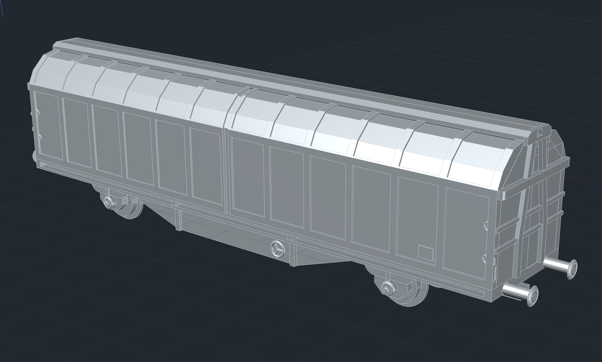

# Hbbillns Freight Car Model

## H0 model of a Hbbillns type freight car

Author: Noah (takadanobaba)

This is a 3d design of a Hbbillns type freight car for H0 model railroads. I provide the original AutoCAD file and stl-files which can be used to print on a 3d printer. I used a Prusa i3 MK3S printer which works very well.

In order to get a fully functional model you need:

- All stl files printed and assembled.
- Couplers to put into the [NEM norm receptacle](https://www.morop.eu/images/NEM_register/NEM_E/nem362_en_2004.pdf). I have used [Märklin Close Coupler Heads](https://www.maerklin.de/de/produkte/details/article/72000), but others will also work.
- Wheelset (2) with the following measures: ø 10,4 x 24,5 mm; also 11 x 25 mm works. I have used [Märklin wheelset 700150](https://www.maerklinshop.de/en/detail/index/sArticle/33206).
- Colors to paint the model.

Here is an image showing how to assemble the coupler:

The whole coupler can then be glued at the bottom at each side of the car. 

I publish the model under the following licence: [CC BY-NC-SA 4.0 Creative Commons Attribution-NonCommercial-ShareAlike 4.0 International](https://creativecommons.org/licenses/by-nc-sa/4.0/)

That means:

- BY: Credit must be given to you, the creator.
- NC: Only noncommercial use of your work is permitted.
- SA: Adaptations must be shared under the same terms.

So please feel free to improve the design, but mention it's origine and share your version under the same licence!

Here you find a photo of printed cars and painted in a heavily weathered way:

